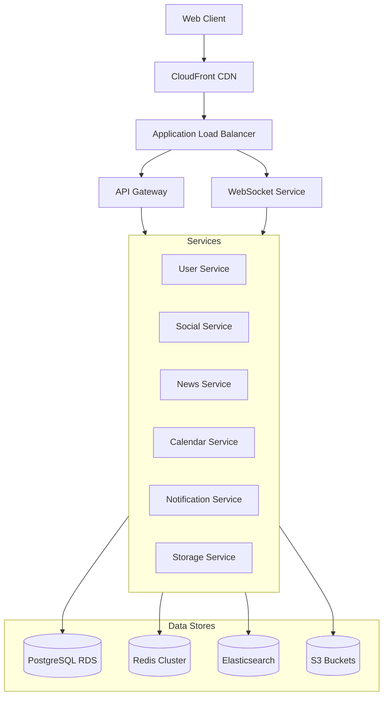
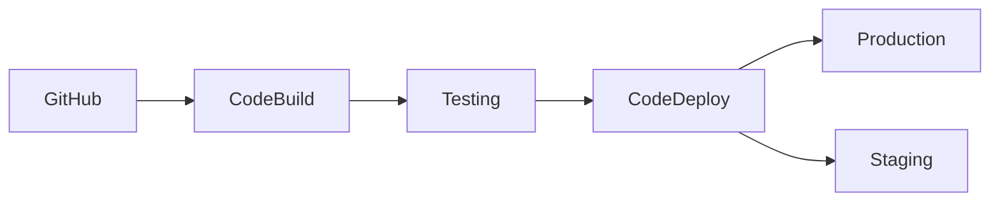

# Deployment Architecture

## Infrastructure Overview

## Service Architecture

### Frontend Deployment
- React application hosted on S3
- CloudFront CDN for global distribution
- Route53 for DNS management
- ACM for SSL certificates

### Backend Services
Each service runs in its own ECS cluster:

1. **User Service**
   - ECS Fargate containers
   - Auto-scaling based on CPU/Memory
   - Direct RDS access
   - S3 access for avatars

2. **Social Service**
   - ECS Fargate containers
   - WebSocket support
   - Redis for caching
   - Elasticsearch for search

3. **News Service**
   - ECS Fargate containers
   - Redis for caching
   - Elasticsearch for article search
   - External API integrations

4. **Calendar Service**
   - ECS Fargate containers
   - Redis for caching
   - External calendar integrations

5. **Notification Service**
   - ECS Fargate containers
   - Redis pub/sub
   - SNS for push notifications
   - SES for emails

6. **Storage Service**
   - ECS Fargate containers
   - S3 for file storage
   - CloudFront for media delivery

## Data Storage

### PostgreSQL RDS
- Multi-AZ deployment
- Read replicas for scaling
- Automated backups
- Point-in-time recovery

### Redis Cluster
- ElastiCache implementation
- Multi-AZ for high availability
- In-memory caching
- Session management
- Real-time data

### Elasticsearch
- Amazon OpenSearch Service
- Multi-AZ deployment
- Auto-scaling enabled
- Daily snapshots

### S3 Storage
- Multiple buckets by purpose
- Lifecycle policies
- Cross-region replication
- CloudFront integration

## Security

### Network Security
- VPC with public/private subnets
- Security groups and NACLs
- VPC endpoints for AWS services
- WAF for API protection

### Authentication & Authorization
- Cognito for JWT management
- IAM roles for services
- KMS for encryption
- Secrets Manager for credentials

### Monitoring & Logging
- CloudWatch for metrics
- CloudTrail for API logs
- X-Ray for tracing
- ELK stack for application logs

## Scaling & High Availability

### Auto Scaling
- ECS service auto-scaling
- RDS read replica scaling
- ElastiCache scaling
- Lambda concurrency scaling

### Load Balancing
- Application Load Balancer
- API Gateway for REST APIs
- WebSocket API Gateway
- CloudFront for static content

### Disaster Recovery
- Multi-AZ deployments
- Cross-region backups
- Regular DR testing
- Automated failover

## CI/CD Pipeline

### Pipeline Stages
1. **Source Control**
   - GitHub repository
   - Branch protection
   - Pull request reviews

2. **Build Process**
   - CodeBuild for compilation
   - Docker image creation
   - Unit tests
   - Security scanning

3. **Testing**
   - Integration tests
   - E2E tests
   - Load testing
   - Security testing

4. **Deployment**
   - Blue/Green deployment
   - Canary releases
   - Automated rollback
   - Health checks

## Cost Optimization

### Strategies
1. **Auto Scaling**
   - Scale based on demand
   - Scheduled scaling
   - Spot instances where applicable

2. **Storage Optimization**
   - S3 lifecycle policies
   - RDS storage optimization
   - Redis cache sizing

3. **Network Optimization**
   - CloudFront caching
   - Regional endpoints
   - VPC endpoint usage

4. **Resource Management**
   - Reserved instances
   - Savings plans
   - Resource tagging
   - Cost allocation

## Monitoring & Alerting

### Metrics
- Service health
- Performance metrics
- Error rates
- Business metrics

### Alerts
- Service disruptions
- Performance degradation
- Security incidents
- Cost anomalies

### Dashboards
- Service overview
- Business metrics
- Cost analysis
- Security status

## Development Environment

### Local Development
- Docker Compose setup
- Local DynamoDB
- Mocked services
- Hot reloading

### Staging Environment
- Isolated AWS account
- Production-like setup
- Integration testing
- Performance testing

### Production Environment
- High availability
- Auto-scaling
- Full monitoring
- DR capabilities
